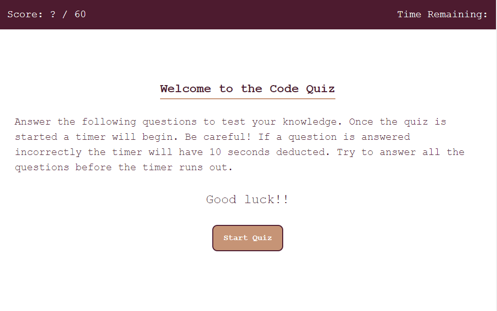

# The Code Quiz

## Description
This coding quiz will test your knowledge of HTML, CSS, Git, and some basic web developer terminology. This was made using HTML, CSS, and JavaScript.

This is our week 4 challenge and we were tasked with using our JavaScript fundamentals and our new knowledge of traversing the DOM to action! If I wasn't sure what the DOM was before this challenge, I sure do now! I feel this challenge truly helepd me understand the DOM and the foundation of JavaScript so much more. 

## The Finished Product

This can be found at : https://oceanlatte.github.io/code-quiz/

